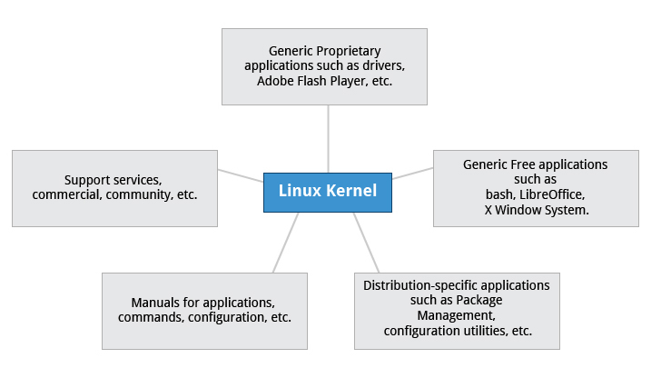
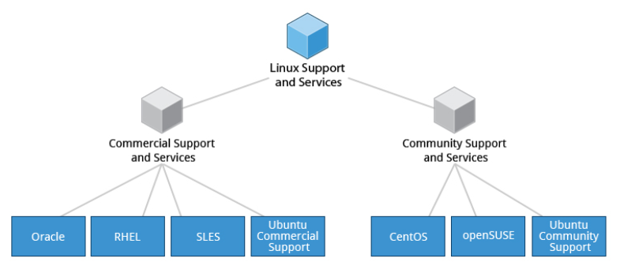
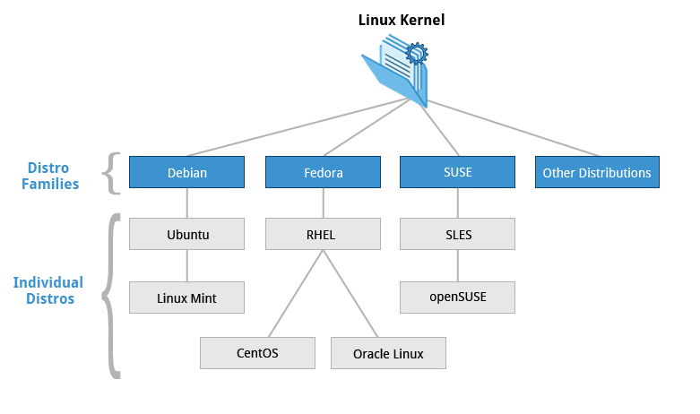

## História do Linux

O Linux empresta muito do sistema operacional UNIX porque foi escrito para ser uma versão gratuita e de código aberto do UNIX. Os arquivos são armazenados em um sistema de arquivos hierárquico, com o nó superior do sistema sendo root ou simplesmente "/".

Sempre que possível, o Linux disponibiliza seus componentes por meio de arquivos ou objetos que se parecem com arquivos. Processos, dispositivos e soquetes de rede são todos representados por objetos semelhantes a arquivos e geralmente podem ser trabalhados usando os mesmos utilitários usados para arquivos comuns.

O Linux é um sistema operacional totalmente multitarefa (um método em que várias tarefas são executadas durante o mesmo período de tempo), multiusuário, com rede integrada e processos de serviço conhecidos como daemons no mundo UNIX. O Linux foi inspirado no UNIX, mas não é UNIX.

**Então, o que é uma distribuição Linux e como ela se relaciona com o kernel do Linux?**

Conforme ilustrado abaixo, o [kernel do Linux](http://www.kernel.org) é o núcleo de um sistema operacional de computador. Uma **distribuição Linux** completa consiste no kernel mais várias outras ferramentas de software para operações relacionadas a arquivos, gerenciamento de usuários e gerenciamento de pacotes de software. Cada uma dessas ferramentas fornece uma pequena parte do sistema completo. Cada ferramenta geralmente é seu próprio projeto separado, com seus próprios desenvolvedores trabalhando para aperfeiçoar essa parte do sistema.

Uma grande variedade de distribuições Linux atende a diferentes públicos e organizações, dependendo de suas necessidades específicas. Grandes organizações comerciais tendem a favorecer as distribuições com suporte comercial da Red Hat, SUSE e Canonical (Ubuntu).

**Serviços associados a distribuições**

O CentOS é uma alternativa gratuita popular ao Red Hat Enterprise Linux (RHEL). Ubuntu e Fedora são populares na área educacional. O Scientific Linux é preferido pela comunidade de pesquisa científica por sua compatibilidade com pacotes de software científicos e matemáticos. Tanto o CentOS quanto o Scientific Linux são binários compatíveis com o RHEL; ou seja, pacotes de software binários na maioria dos casos serão instalados corretamente nas distribuições.

Muitos distribuidores comerciais, incluindo Red Hat, Ubuntu, SUSE e Oracle, fornecem suporte pago de longo prazo para suas distribuições, bem como certificação de hardware e software. Todos os principais distribuidores fornecem serviços de atualização para manter seu sistema preparado com as últimas correções de segurança e bugs e aprimoramentos de desempenho, além de fornecer recursos de suporte online.

**Famílias de distribuição**

**Família Debian**

A distribuição Debian é upstream para várias outras distribuições, incluindo Ubuntu, e Ubuntu é upstream para Linux Mint e outras. É comumente usado em servidores e computadores desktop. O Debian é um projeto de código aberto puro e foca em um aspecto chave, isto é, estabilidade. Ele também fornece o maior e mais completo repositório de software para seus usuários.

O Ubuntu visa fornecer um bom compromisso entre estabilidade a longo prazo e facilidade de uso. Como o Ubuntu obtém a maioria de seus pacotes do ramo estável do Debian, o Ubuntu também tem acesso a um repositório de software muito grande.

_Principais fatos sobre a família Debian:_

* A família Debian é upstream para Ubuntu, e Ubuntu é upstream para Linux Mint e outros.
* Ele usa o gerenciador de pacotes apt-get baseado em DPKG (cobrimos com mais detalhes posteriormente) para instalar, atualizar e remover pacotes no sistema.
* O Ubuntu tem sido amplamente utilizado para implantações em nuvem.

**Família Fedora**

Fedora é a distribuição comunitária que forma a base do Red Hat Enterprise Linux (RHEL), CentOS, Scientific Linux e Oracle Linux. O Fedora contém significativamente mais software do que a versão corporativa da Red Hat. Uma razão para isso é que uma comunidade diversificada está envolvida na construção do Fedora; não é apenas uma empresa.

_Principais fatos sobre a família Fedora:_

* A família Fedora é upstream para CentOS, RHEL e Oracle Linux.
* Suporta plataformas de hardware como x86, x86-64, Itanium, PowerPC e IBM System z.
* Ele usa o gerenciador de pacotes yum baseado em RPM (cobriremos com mais detalhes posteriormente) para instalar, atualizar e remover pacotes no sistema.
* O RHEL é amplamente utilizado por empresas que hospedam seus próprios sistemas.

**Família SUSE**

A relação entre SUSE, SUSE Linux Enterprise Server (SLES) e openSUSE é semelhante à descrita entre Fedora, Red Hat Enterprise Linux e CentOS.

_Principais fatos sobre a família SUSE:_

* SUSE Linux Enterprise Server (SLES) é upstream para openSUSE.
* Ele usa o gerenciador de pacotes zypper baseado em RPM (cobriremos com mais detalhes posteriormente) para instalar, atualizar e remover pacotes no sistema.
* Inclui o aplicativo YaST (Yet another System Tool) para fins de administração do sistema.

Como dito, as maiores diferenças entre as distros são seus sistemas e ferramentas de gerenciamento de pacotes.
Debian (e distribuições derivadas) usam o formato de pacote Debian (.deb), Red-hat (e distribuições derivadas) usam o formato de pacote RPM (.rpm). E distribuições como Arch e Slackware usam seus próprios formatos e ferramentas de empacotamento.

Diferenças de empacotamento à parte, algumas distros - como Debian Testing, Fedora (baseado em Red-hat) e Arch tendem a usar versões mais recentes do kernel do Linux e outros pacotes de software. Mas isso vem com o custo de potencial instabilidade e quebra - o que pode acontecer de tempos em tempos após atualizações nesses sistemas - embora raramente.

Considerando que distribuições como Debian Stable e RHEL usam versões de software mais antigas e melhor testadas. Embora eles usem um software antigo e um pouco desatualizado, eles são considerados muito mais estáveis. Além disso, os mantenedores do pacote sempre mantêm o software corrigido com as atualizações de segurança mais recentes.
